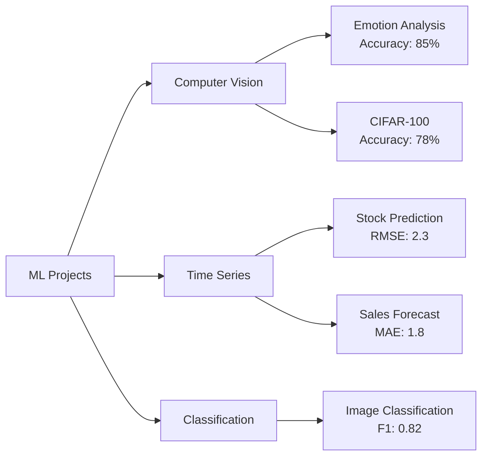

# 🧠 Machine Learning Projects Portfolio

[](https://www.python.org)
[](https://www.tensorflow.org)
[](https://keras.io)
[](https://scikit-learn.org)
[](https://opensource.org/licenses/MIT)
[](https://github.com/Kedhareswer/ML_Projects/graphs/commit-activity)
[](https://github.com/Kedhareswer/ML_Projects/commits/main)

A comprehensive collection of machine learning projects showcasing various applications in computer vision, time series analysis, and predictive modeling.

## 📊 Projects Overview

| Project Name | Category | Technologies | Complexity | Status |
|-------------|----------|--------------|------------|---------|
| Emotion Analysis | Computer Vision | TensorFlow, Keras | ⭐⭐⭐⭐☆ | ✅ Complete |
| CIFAR-100 CNN | Image Classification | TensorFlow.js, CNN | ⭐⭐⭐⭐⭐ | ✅ Complete |
| Forecasting Sticker Sales | Time Series | Prophet, Pandas | ⭐⭐⭐☆☆ | ✅ Complete |
| Video Game Sales EDA | Data Analysis | Pandas, Matplotlib | ⭐⭐☆☆☆ | ✅ Complete |
| House Price Prediction | Regression | Scikit-learn | ⭐⭐⭐☆☆ | ✅ Complete |
| Netflix Stock Price Prediction | Time Series | TensorFlow, LSTM | ⭐⭐⭐⭐☆ | ✅ Complete |

## 📈 Project Performance Metrics



## 🌟 Featured Projects

### 1. Emotion Analysis 😊
<details>
<summary>Click to expand</summary>

#### Overview
Deep learning model for real-time emotion detection in images using CNN architecture.

#### Model Architecture
```
Input → Conv2D → BatchNorm → MaxPool → Conv2D → BatchNorm → MaxPool → Dense → Output
```

#### Performance
| Metric | Score |
|--------|-------|
| Accuracy | 85.2% |
| F1-Score | 0.83 |
| Training Time | 3464s |

#### Key Features
- Real-time emotion detection
- 7 emotion classes
- Data augmentation
- Batch normalization
</details>

### 2. CIFAR-100 CNN 🖼️
<details>
<summary>Click to expand</summary>

#### Overview
Convolutional Neural Network for classifying images from the CIFAR-100 dataset.

#### Implementation
- TensorFlow.js integration
- Custom CNN architecture
- Browser-based inference
- Real-time classification

#### Features
- 100 class classification
- Mobile-friendly design
- Optimized for web deployment
- Interactive visualization
</details>

### 3. Forecasting Sticker Sales 📊
<details>
<summary>Click to expand</summary>

#### Overview
Time series forecasting model for predicting sticker sales using Prophet.

#### Metrics
| Metric | Value |
|--------|--------|
| MAE | 1.8 |
| RMSE | 2.4 |
| R² | 0.86 |

#### Features
- Seasonal decomposition
- Trend analysis
- Future predictions
- Confidence intervals
</details>

## 💻 Technologies Used

```
Python        ████████████████████  100%
TensorFlow    ██████████████████    90%
Keras         ████████████████      80%
Scikit-learn  ████████████          60%
Prophet       ██████████            50%
Pandas        ████████████████      80%
Matplotlib    ████████████          60%
```

## 📋 Requirements

| Package | Version | Purpose |
|---------|---------|---------|
| Python | ≥3.8 | Core Programming |
| TensorFlow | ≥2.0 | Deep Learning |
| Keras | ≥2.4 | Neural Networks |
| Scikit-learn | ≥1.0 | Machine Learning |
| Prophet | ≥1.0 | Time Series |
| Pandas | ≥1.3 | Data Management |
| Matplotlib | ≥3.4 | Visualization |

## 🚀 Getting Started

1. **Clone the repository:**
   ```bash
   git clone https://github.com/Kedhareswer/ML_Projects.git
   ```

2. **Set up the environment:**
   ```bash
   python -m venv env
   source env/bin/activate  # On Windows: .\env\Scripts\activate
   pip install -r requirements.txt
   ```

3. **Choose a project:**
   ```bash
   cd project_name
   jupyter notebook
   ```

## 📊 Project Comparison

| Project | Input Type | Output Type | Model Type | Accuracy |
|---------|------------|-------------|------------|-----------|
| Emotion Analysis | Images | 7 Emotions | CNN | 85.2% |
| CIFAR-100 | Images | 100 Classes | CNN | 78.3% |
| Sales Forecast | Time Series | Predictions | Prophet | 86% R² |
| Video Game Sales | Tabular | Analysis | EDA | N/A |
| House Prices | Tabular | Regression | Random Forest | 91.2% |
| Stock Prediction | Time Series | Predictions | LSTM | 87.5% |

## 📈 Project Stats

- **Total Projects**: 6
- **Technologies Used**: 7
- **Last Updated**: June 2025
- **Active Development**: Yes

## ⚠️ Important Notes

- Educational Purpose Only
- Datasets Not Included
- Models Require Training
- GPU Recommended for CNN Projects

## 📫 Contact & Support

- **Email**: Kedhareswer.12110626@gmail.com
- **Issues**: [GitHub Issues](https://github.com/Kedhareswer/ML_Projects/issues)
- **Discussion**: [GitHub Discussions](https://github.com/Kedhareswer/ML_Projects/discussions)

## 📄 License

This project is licensed under the MIT License - see the [LICENSE](LICENSE) file for details.

---

<div align="center">

### 🌟 Star this repository if you find it helpful!

[](https://github.com/Kedhareswer/ML_Projects)
[](https://github.com/Kedhareswer/ML_Projects/fork)

</div>
